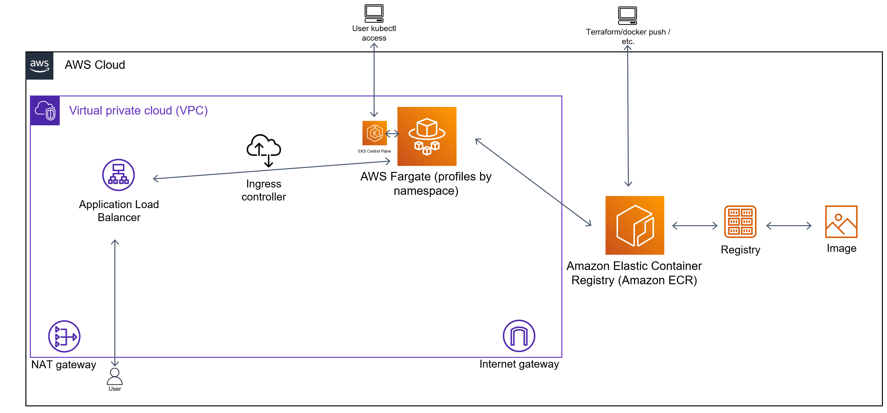

# You should start from here

## Used OS

| Name | Version |
|------|---------|
| Ubuntu WSL2 | v22.04.3 |

## Used tools

| Name | Version |
|------|---------|
| terraform | v1.6.6 |
| aws-cli | v2.11.11 |
| docker | v24.0.7 |
| kubectl | v1.27.2 |
| microk8s | v1.29.4 |

# How to use this solution (AWS)

1. Download this repo.
2. Be sure you have all tools from the list above (excluding microk8s).
3. Create an IAM user with an `AdministratorAccess` policy and access key (this is only for this homework; never do this in typical cases).
4. Configure your aws-cli to consume this IAM user with the `eu-west-2` region and the `default` profile.
3. cd to the `terraform` dir.
4. `terraform init` -> `terraform plan` -> `terraform apply`
6. Wait and relax. A good strong cuppa?
7. Go back to the main dir and run `docker_bp_kubeconfig.sh`. It should log you into the ECR repo, build the image, tag it, push it, and log you into the EKS cluster (and switch the context). It should also output cluster information.
8. Check if aws-lb and metrics-server work correctly (they should be running). If not, sometimes you need to `rollout restart` them to trigger the Fargate scheduler again.
9. If everything is fine, you should run the script, `k8s_deploy.sh`. It should replace the ECR image location with the correct one from the terraform output in the deployment file, create the ns and apply resources (deployment, service, ingress and HPA)
10.  Now, you need to wait once again. You can run, for example, the `watch kubectl get pods,ingress,hpa -n app-checkout` command. After some time, you should get the ALB URL, but wait for `1/1 Running` next to pods and metrics for HPA. This should take up to 5 minutes. You can curl the ALB URL or open it in the web browser. You can use plain `/` for "Hello, world!" or add to the end `/health` path if you want the health endpoint.
11. To use `terraform destroy` correctly without any non-removable warnings and orphan ALB from the app, you should run before the `k8s_delete.sh` script. It will remove the app resources (together with triggering ALB removal) and ECR images from the repository.
12. Go again into the `terraform` directory and run `terraform destroy`.

# Diagram



# General notes about the solution (AWS)

1. The entire solution is based on AWS cloud, where I used ECR for the private docker images registry, VPC for the networking layer, EKS for orchestration with Fargate profiles, IAM policies for some of the configuration and access profiles, and finally, helm to deploy the metrics server and ingress controller for ALB.
2. I used some Terraform modules prepared for AWS to speed up this a little because I had a bad experience with AWS, and they blocked my account due to suspicious activities.
3. Some values are hardcoded to avoid using massive/expensive instances.
4. Outputs are only used for some bash scripts to speed up docker build/push and to edit k8s resources.
5. For the app, I used a super simple Dockerfile.
6. I used Fargate profiles for flexibility and cost efficiency.
7. VPC is mostly private, but EKS access is open (you still need to authorize yourself). Of course, this is the same with potential ALB.
8. Three main Fargate profiles are provided—for the app, for the ingress and metrics, and for the system solutions (e.g., coredns).
9. Due to Fargate limitations, the API metrics endpoint cannot reach the node where you have the metrics server.
10. The app is deployed as a simple K8s app with SVC, ingress (ALB), and a simple HPA profile.
11. I didn't use any Terraform state storage.
12. Due to some AWS limitations around Fargate and free accounts, sometimes nodes do not spin up in the first run. A higher quota can easily solve this, but I can't get it now. In this case, you can just rerun "terraform apply", and everything should be fine after.
13. Scaling is based on HPA for the app pods, Fargate profiles for K8s worker nodes, and ALB for the access endpoint. To avoid downtime, the app can be replaced via the Rolling Update strategy.

# What should be done (AWS)

1. I should try to avoid DRY in the code.
2. GitLab CI/CD or other solution to automate Docker image build, infra, and app deployment. GitLab variables for some non-sensitive data, separate jobs for steps, validation, and deployment via custom, small Docker images and outputs stored in the artifacts to grab them when needed and reuse them, for example, in other jobs.
3. Dynamic variables.
4. The app should probably be a Helm chart for easier deployment and to manage releases, rollbacks, and values more easily.
5. More granulated IAM policies.
6. I should create my own modules to better manage the entire solution (but Terraform modules were more than enough for this task).
7. More control over VPC access between resources, EKS behind VPN/DA.
8. Less chaotic code.
9. Maybe the helm_release parts should be more part of the separate CI/CD. I don't like this in the IaC.
10. The proper Terraform state storage.
11. Monitoring based on CloudWatch and Grafana, with additional solutions for app logs in Loki with Grafana Agent or Promtail. Prometheus on Thanos? Of course, it depends on what is already in use.
12. Security, security, and more security. Starting from the already mentioned IAMs, VPC, and EKS access, but also something for apps—not running the app as the root user, maybe AppArmor for some critical stuff.
13. Granulated IAM user to deploy the solution.

# How to use this solution (local machine)

1. Download this repo.
2. You probably need only microk8s, but you can also install kubectl to avoid managing kubectl from the microk8s command.
3. Run `microk8s enable metrics-server` (for HPA).
4. From the main dir of this repo, run `microk8s kubectl apply -f k8s-resources-local/`.
5. It should create a deployment (with the image from my public Dockerhub account), SVC (NodePort), and HPA profile (scaling) for you.
6. You can access the app via microk8s node ip + random port from the `checkout-svc` service from the `default` namespace. You can use `/` and `health`.

# What we can use/do for a better project

1. Use Trivy to scan the container before deployment. Something like (based on GitLab CI):
```
scan:docker:
  stage: security
  image: "docker:26-dind"
  variables:
    DOCKER_TLS_CERTDIR: ""
    DOCKER_HOST: tcp://docker:2375/
    DOCKER_DRIVER: overlay2
	TRIVY_VERSION: "v0.51.1"
  script:
    - docker login -u gitlab-ci-token -p $CI_BUILD_TOKEN registry.example.com
    - wget -O - https://raw.githubusercontent.com/aquasecurity/trivy/main/contrib/install.sh | sh -s -- -b /usr/local/bin ${TRIVY_VERSION}
    - trivy --version
    # cache cleanup is needed when scanning images with the same tags, it does not remove the database
    - trivy image --no-progress --clear-cache
    # update vulnerabilities db
    - trivy image --no-progress --download-db-only
    - trivy image --scanners vuln,config --exit-code 1 --severity CRITICAL --ignore-unfixed ${CI_REGISTRY_IMAGE}:${CI_COMMIT_TAG:-$CI_COMMIT_REF_SLUG}
  rules:
    - exists:
        - Dockerfile
  tags:
    - runners
```
2. We can use Helm + ArgoCD for deployment to K8s. I didn't use it here because it would take a lot of time for a super simple app.
